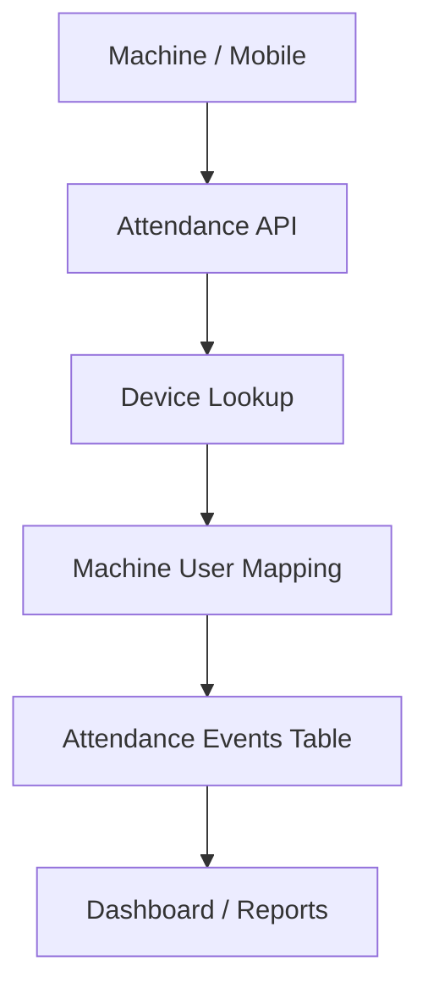

# 📘 PunchDesk

## Attendance Punch System (Machine + Mobile)

### **FINAL LOCKED FLOW & WIREFRAME (Phase-1)**

---

## 1️⃣ Scope of This Document

This document covers:

* Attendance punching via **biometric machines**
* Attendance punching via **mobile app**
* Machine user ↔ system user mapping
* Multi-device per organization
* Future-ready biometric types (finger, face, palm, card)
* Final DB tables (locked)
* API design (Flask)
* UI pages & wireframes (React Web + React Native)

❌ Attendance calculation
❌ Payroll
❌ Shift logic

(Those are next phases)

---

## 2️⃣ Final Locked Tables (DO NOT CHANGE)

### ✅ `devices`

### ✅ `machine_users`

### ✅ `attendance_events`

> **This design is LOCKED for Phase-1**

---

## 3️⃣ Table Design (Final)

---

### 3.1 `devices`

Represents every physical attendance device.

```text
devices
-------
id (PK)
org_id
device_serial_no
device_name
status               -- active / inactive
created_at
```

### Notes

* One org → multiple devices
* Example:

  * Main Gate IN
  * Main Gate OUT
  * Back Gate

---

### 3.2 `machine_users`  ⭐ KEY TABLE (LOCKED)

Maps **PunchDesk user** ↔ **machine user**

```text
machine_users
-------------
id (PK)
org_id
device_id
user_id               -- PunchDesk user
external_user_id      -- device user id / enroll id
verification_type     -- finger / face / palm / card
status                -- active / inactive
created_at
```

### Constraints

```text
UNIQUE (device_id, external_user_id, verification_type)
INDEX (org_id, user_id)
```

### Meaning

* One PunchDesk user can have **multiple machine identities**
* Machine replace ho → sirf new rows add
* Finger + face + card all supported

---

### 3.3 `attendance_events` (RAW PUNCH DATA)

```text
attendance_events
-----------------
id (PK)
org_id
device_id
user_id               -- resolved via machine_users
external_user_id      -- raw value from machine
event_time
event_type            -- IN / OUT
verification_type     -- finger / face / palm / card / mobile
lat NULL              -- mobile only
lng NULL              -- mobile only
raw_payload JSON NULL
created_at
```

### Important Rule

> **This table stores ONLY raw punches**
> No business logic, no salary logic.

---

## 4️⃣ High-Level Attendance Flow



---

## 5️⃣ Machine Attendance Flow (Step-by-Step)

### 5.1 Device Registration (Org Admin)

* Org Admin registers device
* Device gets `device_id`
* Device mapped using `device_serial_no`

---

### 5.2 Machine User Registration (VERY IMPORTANT)

Before attendance works, **machine users must be mapped**.

#### Flow

1. Admin opens **Machine User Mapping page**
2. Selects:

   * Device
   * PunchDesk user
   * External user ID (from machine)
   * Verification type
3. Save

---

## 6️⃣ Machine User Mapping – Web UI

### Route (React Web)

```
/devices/:device_id/machine-users
```

---

### UI – Machine User Mapping Page

```
Machine Users – Device: Main Gate IN
------------------------------------------------
User Name     External ID   Type    Status   Action
Ramesh        1001          Finger  Active   Edit
Suresh        2005          Face    Active   Edit

[ + Add Machine User ]
```

---

### Add Machine User Modal

```
Add Machine User
--------------------------
PunchDesk User: [ Select ▼ ]
External User ID: [______]
Verification Type: [ Finger ▼ ]

[ Cancel ]   [ Save ]
```

---

### API (Flask)

#### Create Machine User

`POST /api/org/devices/{device_id}/machine-users`

```json
{
  "user_id": "uuid",
  "external_user_id": "1001",
  "verification_type": "finger"
}
```

---

## 7️⃣ Machine → PunchDesk Event API

### Endpoint

```
POST /api/attendance/device/push
```

### Headers

```
X-DEVICE-SERIAL: ES12345
```

---

### Payload (Generic, Vendor-Agnostic)

```json
{
  "external_user_id": "1001",
  "event_time": "2025-01-15 09:01:10",
  "event_type": "IN",
  "verification_type": "finger",
  "raw": {
    "vendor": "eSSL",
    "data": "..."
  }
}
```

---

### Backend Processing Logic

```text
1. Find device by serial number
2. Lookup machine_users:
   device_id + external_user_id + verification_type
3. If found → user_id resolved
4. Insert into attendance_events
5. If not found → user_id NULL but event saved
```

> ❗ Never reject punch because mapping missing
> Always save raw data for audit

---

## 8️⃣ Mobile Attendance Flow (React Native)

### 8.1 Mobile Punch API

```
POST /api/attendance/mobile/punch
Authorization: Bearer <JWT>
```

### Payload

```json
{
  "event_type": "IN",
  "event_time": "2025-01-15 09:05:00",
  "lat": 28.0167,
  "lng": 73.3149
}
```

---

### Backend Handling

* `user_id` → from JWT
* `device_id` → NULL
* `external_user_id` → NULL
* `verification_type` → mobile
* Insert into `attendance_events`

---

## 9️⃣ React Native – Staff Attendance UI

### Route

```
/attendance
```

---

### Wireframe (Mobile)

```
---------------------------------
Good Morning, Ramesh 👋

Status: Not Punched In

[  Punch IN  ]

---------------------------------
Location: Verified ✅
---------------------------------
```

After punch:

```
Status: Working
Punch In Time: 09:05 AM

[ Punch OUT ]
```

---

## 10️⃣ Org Admin – Attendance View (Web)

### Route

```
/attendance
```

---

### Wireframe

```
Attendance – Today
------------------------------------------------
User     Time       Type  Method   Device
Ramesh   09:01 AM   IN    Finger   Gate IN
Ramesh   06:05 PM   OUT   Finger   Gate OUT
```

Filters:

* Date
* User
* Device
* Verification type

---

## 11️⃣ Why This Architecture is FINAL & CORRECT

### ✅ Simple

* Only 3 tables
* Easy queries
* Fast development

### ✅ Future-Ready

* Multiple biometric types
* Machine replacement safe
* Raw payload preserved

### ✅ Scalable

* Multiple devices per org
* Large event volume supported

### ✅ Auditable

* Never lose punch data
* Debug-friendly

---

## 12️⃣ FINAL LOCK CONFIRMATION ✅

We are **LOCKING THIS DESIGN**:

✔ `devices`
✔ `machine_users`
✔ `attendance_events`

❌ No extra mapping tables
❌ No over-engineering
