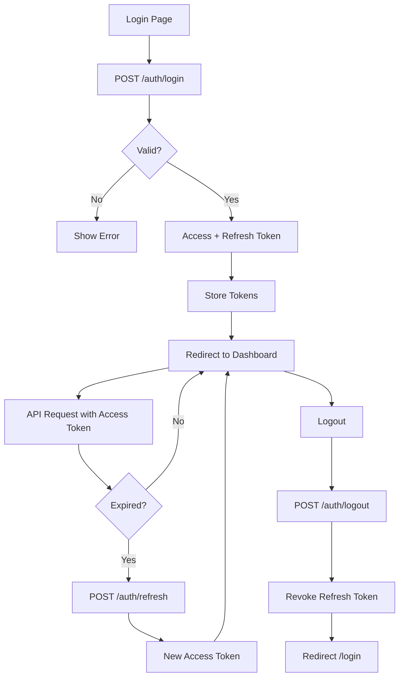

# 📘 PunchDesk

## User, Role, Token & Authentication Flow

**(Final Design – Phase 1)**

---

## 1️⃣ Scope of This Document

This document covers:

* User module (Org-level users only)
* Role system (fixed, org-type based)
* User ↔ Role many-to-many relationship
* JWT authentication (access + refresh tokens)
* Token storage & logout strategy
* Complete login flow
* API design (Flask)
* UI pages & wireframes (React / React Native)

❌ Super Admin is **not part of this project**
❌ Org creation already happens via **external Admin Console**

---

## 2️⃣ Core Design Principles

* **Multi-tenant SaaS**
* **Org isolation is mandatory**
* **Roles are fixed (seed once)**
* **JWT-based stateless auth**
* **Refresh token stored in DB**
* **Simple, scalable, secure**

---

## 3️⃣ Data Model Overview

```
org_types
   └── roles
         └── role_user
               └── users
                     └── refresh_tokens
```

---

## 4️⃣ Database Tables (Final)

---

### 4.1 `org_types` (Fixed – Seed Once)

Defines organization categories.

| Column | Type          | Notes                    |
| ------ | ------------- | ------------------------ |
| id     | SMALLINT (PK) |                          |
| code   | VARCHAR(30)   | office, school, hospital |
| name   | VARCHAR(50)   | Display name             |

**Example**

```
1 → office
2 → school
3 → hospital
4 → factory
```

---

### 4.2 `roles` (Fixed – Org-Type Based)

Each role belongs to **one org type**.

| Column       | Type          | Notes                         |
| ------------ | ------------- | ----------------------------- |
| id           | SMALLINT (PK) |                               |
| code         | VARCHAR(30)   | ORG_OWNER, HR, MANAGER, STAFF |
| display_name | VARCHAR(50)   | Owner, HR, Manager            |
| org_type_id  | SMALLINT (FK) | org_types.id                  |
| created_at   | TIMESTAMP     |                               |

✔ Filters roles automatically by org type
✔ No extra mapping table needed

---

### 4.3 `users` (Org-Level Users)

| Column        | Type         | Notes             |
| ------------- | ------------ | ----------------- |
| id            | UUID (PK)    |                   |
| org_id        | UUID (FK)    | always required   |
| name          | VARCHAR(120) |                   |
| email         | VARCHAR(150) | unique per org    |
| mobile        | VARCHAR(20)  |                   |
| employee_code | VARCHAR(50)  | optional          |
| password      | VARCHAR(255) | hashed            |
| status        | VARCHAR(20)  | active / inactive |
| last_login_at | TIMESTAMP    |                   |
| created_at    | TIMESTAMP    |                   |
| updated_at    | TIMESTAMP    |                   |

**Constraints**

* UNIQUE(org_id, email)
* Org isolation enforced everywhere

---

### 4.4 `role_user` (Pivot – Many to Many)

| Column      | Type          | Notes                   |
| ----------- | ------------- | ----------------------- |
| id          | UUID (PK)     |                         |
| org_id      | UUID (FK)     | performance & isolation |
| user_id     | UUID (FK)     |                         |
| role_id     | SMALLINT (FK) |                         |
| assigned_by | UUID          | who assigned            |
| created_at  | TIMESTAMP     |                         |

**Rules**

* UNIQUE(user_id, role_id)
* One user can have multiple roles

---

### 4.5 `refresh_tokens` (Backend Token Storage)

Used for **logout, revoke, security**.

| Column     | Type         | Notes        |
| ---------- | ------------ | ------------ |
| id         | UUID (PK)    |              |
| user_id    | UUID (FK)    |              |
| org_id     | UUID (FK)    |              |
| token_hash | VARCHAR(255) | hashed token |
| expires_at | TIMESTAMP    |              |
| revoked_at | TIMESTAMP    | nullable     |
| user_agent | TEXT         |              |
| ip_address | VARCHAR(50)  |              |
| created_at | TIMESTAMP    |              |

❌ Access tokens are **not stored**
✅ Refresh tokens **must be stored**

---

## 5️⃣ JWT Token Strategy (Final)

### Token Types

| Token         | Lifetime      | Stored in DB |
| ------------- | ------------- | ------------ |
| Access Token  | 10–15 minutes | ❌ No         |
| Refresh Token | 7–30 days     | ✅ Yes        |

---

### JWT Payload (Access Token)

```json
{
  "sub": "user_id",
  "org_id": "org_id",
  "roles": ["HR","MANAGER"],
  "iat": 1710000000,
  "exp": 1710000900
}
```

---

## 6️⃣ Authentication Flow (End-to-End)



---

## 7️⃣ Auth APIs (Flask)

---

### 7.1 Login

**POST** `/api/auth/login`

```json
{
  "email": "hr@abc.com",
  "password": "*****"
}
```

**Response**

```json
{
  "success": true,
  "data": {
    "access_token": "jwt",
    "refresh_token": "jwt",
    "expires_in": 900,
    "user": { "id":"", "name":"", "org_id":"" },
    "roles": ["HR"],
    "org": { "id":"", "org_type_id": 1 }
  }
}
```

**Validations**

* User active
* Org active
* Password correct

---

### 7.2 Refresh Token

**POST** `/api/auth/refresh`

```json
{ "refresh_token": "jwt" }
```

* Check DB
* Not revoked
* Not expired
* Issue new access token

---

### 7.3 Logout

**POST** `/api/auth/logout`

```json
{ "refresh_token": "jwt" }
```

* Set `revoked_at`
* Token unusable after this

---

### 7.4 Session Check

**GET** `/api/auth/me`

Returns user + roles + permissions

---

## 8️⃣ User Module APIs (Org Side)

---

### 8.1 Get Allowed Roles (By Org Type)

**GET** `/api/org/roles`

```json
{
  "success": true,
  "data": [
    { "id":1, "code":"HR", "display_name":"HR" },
    { "id":2, "code":"STAFF", "display_name":"Staff" }
  ]
}
```

---

### 8.2 Create User

**POST** `/api/org/users`

```json
{
  "name": "Ramesh",
  "email": "ramesh@abc.com",
  "roles": ["STAFF"]
}
```

* User insert
* role_user insert
* Temp password generated

---

### 8.3 Update User Roles

**PUT** `/api/org/users/{id}/roles`

```json
{ "roles": ["MANAGER","HR"] }
```

* Replace pivots (transaction)
* Validate org_type

---

### 8.4 List Users

**GET** `/api/org/users`

Filters:

* status
* role
* search

---

## 9️⃣ UI Pages & Wireframes

---

### 9.1 Login Page

**Route:** `/login`

```
------------------------
 PunchDesk Login
------------------------
 Email:    [_________]
 Password: [_________]

 [ Login ]
```

---

### 9.2 Users List

**Route:** `/users`

```
Users     [Search____]  [+ Add User]
------------------------------------
Name     Email        Roles     Status   Actions
Ramesh   r@abc.com    [STAFF]   Active   Edit Disable
```

---

### 9.3 Create User

**Route:** `/users/create`

```
Create User
----------------------
Name:  [________]
Email: [________]
Roles: [ STAFF ▼ ] (multi-select)

[Cancel]  [Save]
```

On success:

```
Temp Password: XyZ@123
[Copy]
```

---

### 9.4 Edit User

**Route:** `/users/:id/edit`

* Update basic info
* Update roles
* Activate / Deactivate

---

## 🔐 10️⃣ Security Rules (Mandatory)

* Every request validates `org_id`
* Roles enforced via middleware
* Refresh token hashed
* Access token never stored
* Logout = revoke refresh token

---

## ✅ FINAL LOCKED DECISIONS

* One `users` table
* Roles fixed, org-type based
* Many-to-many user ↔ role
* JWT access token (stateless)
* Refresh token stored in DB
* Clean org isolation
